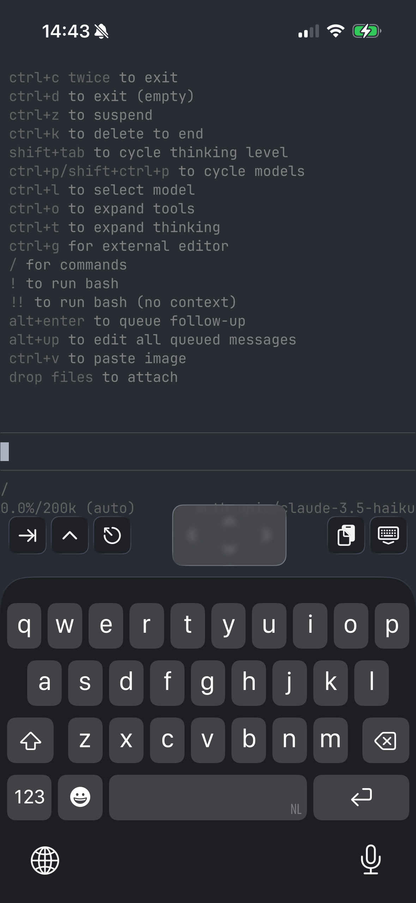

# Pi for iOS

Run the [Pi coding agent](https://github.com/mariozechner/pi-coding-agent) natively on iOS.

<p align="center">
  
</p>

## Features

- **Native Performance**: Runs Bun's JavaScript engine directly on iOS using JSC's C_LOOP interpreter
- **GPU-Accelerated Terminal**: Uses [Ghostty](https://ghostty.org)'s Metal-based terminal renderer
- **Full Pi Agent**: Complete pi coding agent with tool use, file operations, and more
- **Works Offline**: No WebView, no remote execution - everything runs locally on device

## Requirements

- iOS 17.0+
- iPhone with arm64 processor
- OpenRouter API key (for AI model access)

## Installation

### From Source

1. **Clone the repository**
   ```bash
   git clone https://github.com/dannote/pi-ios.git
   cd pi-ios
   ```

2. **Download pre-built dependencies**
   
   Download the vendor libraries from [Releases](https://github.com/dannote/pi-ios/releases) and extract to `vendor/`:
   ```bash
   tar -xzf vendor-libs.tar.gz -C vendor/
   ```
   
   Or build from source (see [Building Dependencies](#building-dependencies)).

3. **Generate Pi bundle**
   
   The Pi agent JavaScript bundle is not included in the repo. Generate it:
   ```bash
   cd /path/to/pi-coding-agent
   bun run build:ios
   cp dist/pi-ios-bundle.js /path/to/pi-ios/app/Pi/Resources/
   ```

4. **Generate Xcode project**
   ```bash
   cd app
   xcodegen generate
   ```

5. **Open in Xcode and build**
   ```bash
   open Pi.xcodeproj
   ```
   
   Select your device and build (⌘B).

### Setting Up API Key

Pi requires an OpenRouter API key to access AI models. Create a `config.json` file in the app's Documents folder:

**Option 1: Using devicectl (from Mac)**
```bash
echo '{"openrouter_api_key": "sk-or-v1-your-key-here"}' > /tmp/config.json
xcrun devicectl device copy to \
  --device YOUR_DEVICE_UDID \
  --domain-type appDataContainer \
  --domain-identifier com.dannote.pi \
  --source /tmp/config.json \
  --destination Documents/config.json
```

**Option 2: Using Files app (on iPhone)**
1. Open the Files app
2. Navigate to "On My iPhone" → "Pi"
3. Create a new file called `config.json`
4. Add: `{"openrouter_api_key": "sk-or-v1-your-key-here"}`

## Building Dependencies

Pi requires three main dependencies to be built for iOS:

### 1. WebKit/JavaScriptCore

Build WebKit for iOS with C_LOOP interpreter enabled (required since JIT is not available on iOS):

```bash
cd ~/Development
git clone https://github.com/ArtSabintsev/WebKit.git
cd WebKit
mkdir build-ios-device && cd build-ios-device

cmake .. \
    -G Ninja \
    -DCMAKE_BUILD_TYPE=Release \
    -DCMAKE_SYSTEM_NAME=iOS \
    -DCMAKE_OSX_SYSROOT=iphoneos \
    -DCMAKE_OSX_ARCHITECTURES=arm64 \
    -DPORT=JSCOnly \
    -DENABLE_STATIC_JSC=ON \
    -DENABLE_JIT=OFF \
    -DENABLE_C_LOOP=ON \
    -DENABLE_WEBASSEMBLY=OFF \
    -DENABLE_SAMPLING_PROFILER=OFF

ninja JavaScriptCore
```

### 2. Bun

Build Bun for iOS using the iOS port:

```bash
git clone https://github.com/dannote/bun.git -b ios-port
cd bun
mkdir build/ios-device && cd build/ios-device

cmake ../.. \
    -G Ninja \
    -DCMAKE_BUILD_TYPE=Release \
    -DCMAKE_TOOLCHAIN_FILE=../../cmake/toolchains/ios-device.cmake

ninja
```

### 3. Ghostty

Build Ghostty for iOS:

```bash
git clone https://github.com/dannote/ghostty.git -b ios-manual-backend
cd ghostty

zig build \
    -Doptimize=ReleaseFast \
    -Dtarget=aarch64-ios \
    --build-file src/build.zig
```

## Architecture

```
┌─────────────────────────────────────────────────────┐
│                     Pi for iOS                       │
├─────────────────────────────────────────────────────┤
│  SwiftUI App                                        │
│    ├─ TerminalView (UIView + UIKeyInput)            │
│    ├─ KeyboardAccessory (iOS 26 Liquid Glass)       │
│    └─ BunGhosttyBridge (pipes stdin/stdout)         │
├─────────────────────────────────────────────────────┤
│  Ghostty Terminal (Metal GPU rendering)             │
│    └─ Manual termio backend for iOS                 │
├─────────────────────────────────────────────────────┤
│  Bun Runtime (JSC with C_LOOP interpreter)          │
│    ├─ iOS embedding API (bun_start, bun_eval)       │
│    ├─ Stubs for iOS-unsupported features            │
│    └─ Full npm package compatibility                │
├─────────────────────────────────────────────────────┤
│  Pi Coding Agent (bundled JavaScript)               │
│    └─ Interactive mode, tools, AI integration       │
└─────────────────────────────────────────────────────┘
```

## Key Technical Achievements

- **Bun on iOS**: First working port of Bun to iOS, using JSC's C_LOOP interpreter instead of JIT
- **Ghostty on iOS**: Manual termio backend for Ghostty's GPU-rendered terminal
- **No Private APIs**: App Store compliant - no JIT, no private frameworks
- **Native Performance**: ~600ms cold start, full npm package support

## Known Limitations

- **No JIT**: JavaScript runs in interpreter mode (~10x slower than JIT)
- **No WebAssembly**: Disabled due to JIT requirement
- **No CPU Profiler**: Sampling profiler requires JIT
- **Memory**: C_LOOP interpreter uses more memory than JIT

## Related Projects

- [pi-coding-agent](https://github.com/mariozechner/pi-coding-agent) - The pi coding agent
- [Bun iOS Port](https://github.com/dannote/bun/tree/ios-port) - Bun runtime for iOS
- [Ghostty iOS](https://github.com/dannote/ghostty/tree/ios-manual-backend) - Ghostty terminal for iOS

## License

MIT License - see [LICENSE](LICENSE) for details.

## Contributing

Contributions welcome! Please read the contributing guidelines before submitting PRs.
