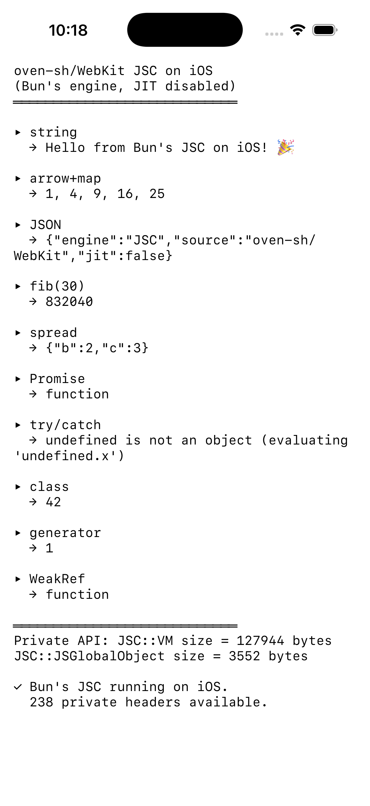

# JSC iOS Demo

Proof of concept: oven-sh/WebKit's JavaScriptCore running on iOS Simulator.



## What this proves

- oven-sh/WebKit JSCOnly compiles for `arm64-apple-ios16.0-simulator`
- JIT disabled (`ENABLE_JIT=0`, `ENABLE_DFG_JIT=0`, `ENABLE_FTL_JIT=0`)
- All modern JS works: arrow functions, classes with private fields, generators, destructuring, Promises, WeakRef
- 238 private JSC headers compile and link (same APIs Bun uses internally)
- `JSC::VM` and `JSC::JSGlobalObject` accessible — the classes Bun's `ZigGlobalObject` subclasses
- Zero private Apple APIs in the binary — only UIKit, Foundation, CoreFoundation, libicucore, libc++

## Static libraries produced

| Library | Size | Contents |
|---------|------|----------|
| libJavaScriptCore.a | 32 MB | Parser, interpreter (LLInt), bytecode compiler, GC, builtins |
| libWTF.a | 2.3 MB | Web Template Framework (strings, containers, threading) |
| libbmalloc.a | 992 KB | Memory allocator |

## Build

```bash
# 1. Clone oven-sh/WebKit (sparse)
git clone --filter=blob:none --sparse https://github.com/oven-sh/WebKit.git
cd WebKit
git sparse-checkout set Source/JavaScriptCore Source/WTF Source/bmalloc Source/cmake Source/CMakeLists.txt

# 2. Apply iOS patches
git apply ../poc/webkit-patches/ios-build-fixes.patch

# 3. Build (or use scripts/build-jsc-ios.sh)
WEBKIT_SRC=. ../scripts/build-jsc-ios.sh iphonesimulator arm64 16.0
```

## Run the demo

```bash
# Compile
SYSROOT=$(xcrun --sdk iphonesimulator --show-sdk-path)
clang++ -c main.mm -target arm64-apple-ios16.0-simulator -isysroot "$SYSROOT" \
  -std=c++2b -fno-exceptions -fno-rtti -fobjc-arc \
  -I path/to/jsc/headers -DHAVE_CONFIG_H=1 -DBUILDING_JSCONLY__ \
  -DSTATICALLY_LINKED_WITH_JavaScriptCore=1 -o main.o

clang++ -c stubs.cpp -target arm64-apple-ios16.0-simulator -isysroot "$SYSROOT" -std=c++2b -o stubs.o

# Link
clang++ main.o stubs.o -target arm64-apple-ios16.0-simulator -isysroot "$SYSROOT" \
  -fobjc-arc -L path/to/jsc/libs -lJavaScriptCore -lWTF -lbmalloc \
  -framework UIKit -framework Foundation -framework CoreFoundation \
  -licucore -lc++ -o BunJSCDemo

# Package and install
mkdir -p BunJSCDemo.app && cp BunJSCDemo Info.plist BunJSCDemo.app/
codesign --force --sign - BunJSCDemo.app
xcrun simctl install booted BunJSCDemo.app
xcrun simctl launch booted com.example.bunjscdemo
```

## stubs.cpp

Six stub functions for Bun's custom event loop integration (`USE_BUN_EVENT_LOOP`).
In a full Bun build these are implemented in Zig. Here they're no-ops since
we're only using JSC's evaluation API.
